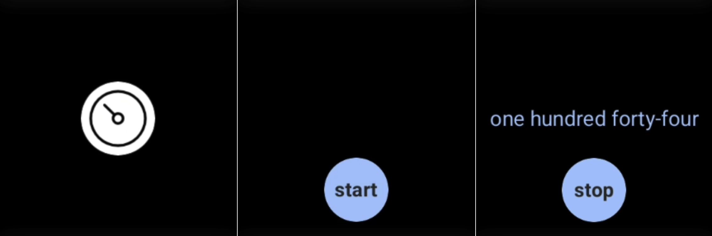

# Text Timer

This project is a basic Android Wear OS application developed in [Kotlin](https://github.com/JetBrains/kotlin) and [Jetpack Compose](https://developer.android.com/compose). It serves as a training exercise to familiarize myself with Jetpack Compose and Wear OS development. The application functions as a stopwatch, counting upwards from zero to measure elapsed time. The time is displayed in spoken form, such as `one hundred forty-four` for 144. The interface is available in German, Russian, and English by default. The application automatically selects the appropriate language based on your system settings.

## Usage

When you stop the timer, you can continue from the point of stopping by clicking on the start. At the expiration of 1000 seconds, the timer will stop, and then you can start again from zero.

## License

[MIT](LICENSE) © [alxiw](https://github.com/alxiw)
